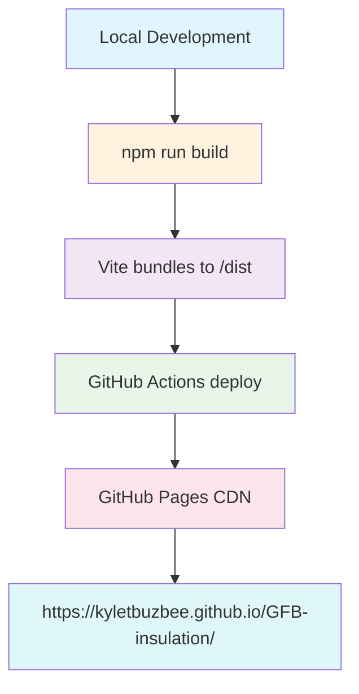

# GitHub Pages Deployment Plan for GFB-insulation

## Executive Summary

Configure the GFB-insulation React project for successful GitHub Pages deployment at `https://kyletbuzbee.github.io/GFB-insulation/`

## Current State Analysis

### Configuration Files Review

| File | Current | Required | Status |
|------|---------|----------|--------|
| `vite.config.ts:25` | `base: '/elite-insulation-solutions/'` | `base: '/GFB-insulation/'` | ❌ Needs Fix |
| `package.json:10-11` | `predeploy` / `deploy` scripts | Already correct | ✅ OK |
| `.github/workflows/deploy.yml` | Uses `actions/deploy-pages@v4` | Already correct | ✅ OK |

### Critical Issue Identified

**Base Path Mismatch**: The Vite config uses `/elite-insulation-solutions/` but the repository is named `GFB-insulation`. This causes all asset paths (CSS, JS, images) to load from the wrong URL, resulting in broken styling and functionality.

## Solution Architecture



## Implementation Steps

### Step 1: Fix vite.config.ts Base Path

**File**: `vite.config.ts:25`

**Current**:
```typescript
base: isProduction ? '/elite-insulation-solutions/' : '/',
```

**Required**:
```typescript
base: isProduction ? '/GFB-insulation/' : '/',
```

### Step 2: Create 404.html for SPA Fallback

GitHub Pages needs a `404.html` that redirects to `index.html` for SPA routing to work correctly.

**File**: `public/404.html`

```html
<!DOCTYPE html>
<html>
<head>
    <meta charset="utf-8">
    <title>404 - Not Found</title>
    <script>
        // Redirect to index.html for SPA routing
        window.location.href = '/GFB-insulation/' + window.location.search;
    </script>
</head>
<body>
    <p>Redirecting...</p>
</body>
</html>
```

### Step 3: Verify GitHub Repository Settings

Required GitHub Settings:
1. **Repository** → **Settings** → **Pages**
2. **Source**: Deploy from a branch
3. **Branch**: `main` (or `gh-pages`)
4. **Folder**: `/ (root)` - NOT `/docs`
5. **Build type**: Select "GitHub Actions"

### Step 4: Trigger Initial Deployment

Push changes to `main` branch to trigger GitHub Actions workflow:
```bash
git add .
git commit -m "Fix base path for GitHub Pages deployment"
git push origin main
```

## Expected URL Structure

After deployment, the site will be accessible at:
- **Production URL**: `https://kyletbuzbee.github.io/GFB-insulation/`
- **Assets load from**: `https://kyletbuzbee.github.io/GFB-insulation/assets/`

## Rollback Plan

If deployment fails:
1. Revert `vite.config.ts` base path change
2. Push to trigger rebuild
3. GitHub Pages auto-rollbacks on workflow failure

## Verification Checklist

- [ ] `vite.config.ts` base path updated to `/GFB-insulation/`
- [ ] `public/404.html` created
- [ ] GitHub Pages enabled in repository settings
- [ ] GitHub Actions workflow completes successfully
- [ ] Site loads at `https://kyletbuzbee.github.io/GFB-insulation/`
- [ ] All assets (CSS, JS, images) load correctly
- [ ] Navigation and routing work as expected

## Commands Reference

| Command | Purpose |
|---------|---------|
| `npm run build` | Build production bundle to `dist/` |
| `npm run preview` | Preview build locally |
| `npm run deploy` | Manual deploy via gh-pages (alternative) |

## Next Steps

1. **Approve this plan** - Switch to Code mode to implement changes
2. **Test locally** - Run `npm run build` and verify output
3. **Push changes** - Trigger GitHub Actions workflow
4. **Verify deployment** - Check final URL in browser
